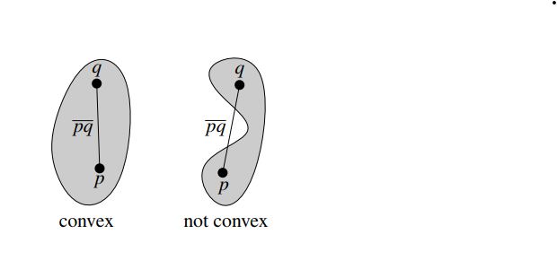
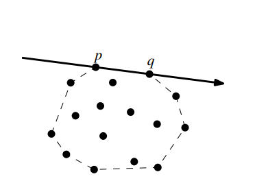

# Convex Hull

## I. Definition
> A subset $S$ of the plane is called *convex* if and only if for any pair of points $p, q \in S$ the line segment $\overline{pq}$ is completely contained in $S$. The *convex hull* $\mathcal{CH}(S)$ of a set $S$ is the smallest convex set that contains $S$. To be more precise, it is the intersection of all convex sets that contain $S$.

**Example:**



## II. Algorithms
### 1. Definition of an edge in convex hull
The first definition of convex hulls is of little help when we want to design an algorithm to compute the convex hull. It talks about the intersection of all convex sets containing $P$. Now, we  can define the edge of $\mathcal{CH}(P)$:
> Both end point $p, q$  of such an edge are point of $P$, and if we direct the line through $p, q$ such that $\mathcal{CH}(P)$ lies to the right, then all the point of $P$ must lie to the right of this line. The reverse is also true: if all points of  $P \setminus \{p, q\}$ lie to right of the directed line through $p, q$, then $\overline{pq}$ is and edge of $\mathcal{CH}(P)$

**Example:**



### 2. Prequisite functions
#### 2.1. Sort a list of points in clockwise order
To sort a list of 2D points in clockwise order, we can use the angles between each point and a reference point (e.g. the centroid) which can calculate by get the average of all x coordinates, and all y coordinates.
```
Input:
6
-2 -2 
4 4  
5 2 
4 -2 
-1 4 
-3 2

Output:
4 4
5 2
4 -2
-2 -2
-3 2
-1 4
```
C++ implementation:
We can sort these points base on it angular form 
#### 2.2. Check if a point lies to right of another point


